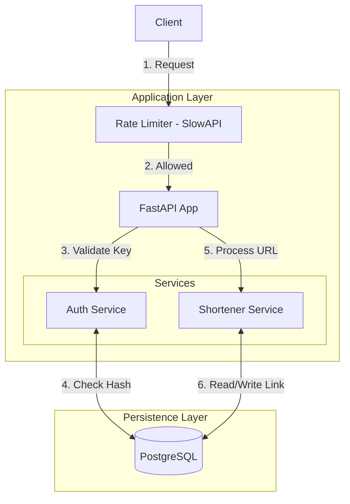

# System Architecture

## Overview

Jinro is a high-performance URL shortening service built with Python and FastAPI. It is designed to be scalable, secure, and easy to deploy. The system handles URL redirection, link management, and API key-based authentication.

## Architecture Diagram



## Core Components

### 1. Application Layer (FastAPI)

The core of the application is built using **FastAPI**, providing:

- **High Performance**: Asynchronous capabilities for handling concurrent requests.
- **Data Validation**: Pydantic models ensure data integrity for requests and responses.
- **Documentation**: Automatic OpenAPI (Swagger) documentation generation.

### 2. Database Layer (PostgreSQL + SQLModel)

- **Database**: PostgreSQL is used for persistent storage of links and API keys.
- **ORM**: **SQLModel** (a wrapper around SQLAlchemy and Pydantic) is used for database interactions, providing type safety and ease of use.
- **Schema**:
  - `ShortenerLink`: Stores the mapping between original URLs and short codes. Includes metadata like creation time and active status.
  - `ApiKey`: Stores hashed API keys for authentication.

### 3. Security & Authentication

- **API Keys**: Access to administrative endpoints (creating/deleting links) is protected by API keys.
- **Hashing**: API keys are stored as **SHA-256 hashes** in the database. The raw key is never stored.
- **Key Rotation**: The system supports key rotation by validating the old key before generating a new one.

### 4. Rate Limiting

- **SlowAPI**: Implemented to prevent abuse of the redirection endpoints.
- **Policy**: The default limit for redirection is set to **25 requests per minute** per client IP.

## Data Flow

### URL Creation Flow

1. Client sends `POST /links` with `api_key` and `original_url`.
2. Server validates the `api_key` hash against the database.
3. Server normalizes the `original_url`.
4. If `short_url` is not provided, a unique code is generated.
5. Link is saved to the database.
6. Returns the created link object.

### URL Redirection Flow

1. Client accesses `/{short_url}`.
2. Rate limiter checks if the client is within limits.
3. Server looks up the `short_url` in the database.
4. If found and active, redirects to `original_url` (HTTP 307).
5. If not found or inactive, returns 404.

## Directory Structure

```
backend/
└── shortener/
    ├── app/
    │   ├── routers/      # API Route definitions
    │   ├── services/     # Business logic
    │   ├── utils/        # Helper functions
    │   └── main.py       # App entry point
    ├── db.py             # Database connection
    └── models.py         # Database models & Schemas
```
